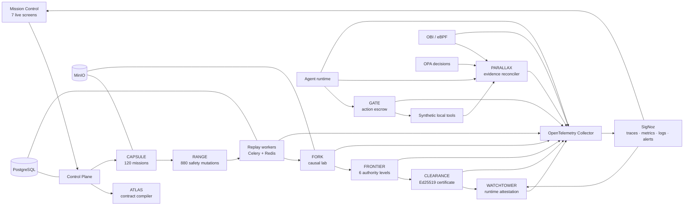

# ORBITAL Σ

### Flight assurance for autonomous agents

An agent can return the right answer while doing the wrong thing. ORBITAL Σ certifies not only what an agent says, but what the system independently observes it doing.

**One-sentence pitch:** ORBITAL Σ is a flight-assurance control plane that uses SigNoz to replay, challenge, explain, bound, certify, and continuously attest autonomous agents before and after deployment.

[](#why-signoz-is-indispensable)
[](#security-and-privacy)
[](#what-the-demo-proves)

## The problem

Traditional evaluation asks whether an agent produced an acceptable response. Consequential agents need stronger evidence:

- Did the tool perform the action the agent declared?
- Was the action authorized at commit time?
- Did retries duplicate an irreversible effect?
- Which combination of prompt, retrieval, schema, policy, and execution caused a failure?
- How much authority is justified by evidence?
- Does the deployed artifact still match the certified artifact?

ORBITAL Σ answers those questions with independent telemetry, signed controls, reproducible counterfactuals, and evidence-bound certification.

## Architecture



The repository retains the original ten-subsystem design: **ATLAS, PARALLAX, GATE, CAPSULE, RANGE, metamorphic testing, FORK, FRONTIER, CLEARANCE, and WATCHTOWER**. See [Architecture](docs/architecture.md) for service boundaries and evidence flow.

## What the demo proves

The final workflow uses only synthetic, locally owned fixtures and labels every result as live, replayed, deterministic simulation, or counterfactual.

1. A corrected candidate shows lower deterministic replay latency and cost than the baseline.
2. A vulnerable local MCP-like fixture declares `store_credit` while calling only the local mock refund service for a synthetic `$900` refund.
3. PARALLAX compares semantic, OBI, OPA, and signed-receipt evidence and returns `CONTRADICTED`.
4. SigNoz records the trace and fires live critical alerts.
5. WATCHTOWER validates the signed webhook, suspends the certificate, sends canary traffic to zero, and restores the certified baseline.
6. FORK reports bounded causal contributions with 95% intervals and reduces the primary failure from 17 elements to 7.
7. FRONTIER evaluates six authority levels and supports level 3, `LOW_VALUE_ACTION`.
8. CLEARANCE verifies an Ed25519-signed certificate with restrictions and rejects artifact drift.
9. A child agent cannot launder refund authority: OPA denies it, GATE returns 403, and no effect occurs.

All displayed values are read from service APIs backed by PostgreSQL, MinIO, Celery, and SigNoz. Playwright fixtures are used only in UI tests, never in the running application.

## Mission Control

| Screen | Evidence shown |
|---|---|
| Launch Console | Candidate, campaign, sensors, live SSE progress |
| Evidence Parity | Semantic claim versus independent observed effect |
| Replay Theater | Queued, running, retried, failed, and completed jobs |
| Causal Graph | Interventions, attribution, confidence, 17→7 reduction |
| Authority Frontier | Six levels, confidence bands, safe boundary |
| Safety Case | Claims → evidence → assumptions → restrictions → residual risks |
| Certificate | Signature, restrictions, drift, rollback, delegation denial |

| | |
|---|---|
|  |  |
|  |  |
|  |  |
|  | |

## Why SigNoz is indispensable

SigNoz is the source of truth for execution evidence—not a dashboard added after evaluation.

- OpenTelemetry SDK spans describe agent intent, policy boundaries, tool calls, capabilities, receipts, replay branches, causal findings, and certificate events.
- OBI/eBPF independently observes the project’s own local HTTP traffic without trusting application instrumentation.
- Trace matching detects an action commit without a matching authorization.
- Query Builder and formulas provide routine assurance metrics.
- ClickHouse SQL derives evidence parity, mission clusters, causal aggregates, authority frontiers, and drift history.
- Live alerts deliver signed webhooks to WATCHTOWER.
- Every important Mission Control result links back to a SigNoz trace, dashboard, query, or alert.
- Foundry uses `casting.yaml` and `casting.yaml.lock` to reproduce the SigNoz and MCP deployment. ORBITAL's idempotent provisioning script creates the dashboards, alert rules, and saved views.

## Quick start for judges

### Native Ubuntu requirements

- Ubuntu 22.04 or 24.04, x86_64
- kernel 5.8+ with readable `/sys/kernel/btf/vmlinux`
- Docker Engine and Compose plugin installed natively
- 8 vCPU, 32 GiB RAM, 100 GiB SSD recommended
- `foundryctl` on `PATH`
- Ollama on a separate local GPU host; the VM does not run Ollama

```bash
git clone https://github.com/Shobhit1Kapoor/Orbital.git
cd Orbital
cp .env.example .env
make reset-demo
make bootstrap
```

`make bootstrap` generates local development secrets, uses Foundry to reproduce SigNoz and its MCP server from `casting.yaml`, starts ORBITAL, applies migrations, idempotently provisions dashboards, alerts, and saved views, and verifies health. Private development keys and `.env` are ignored.

Run the authoritative checks:

```bash
make verify
make verify-obi
make verify-alerts
make verify-campaign
make verify-metamorphic
make verify-causal
make verify-clearance
make verify-delegation
make test-e2e
```

Then present the complete evidence story:

```bash
make final-demo
```

The presentation command assumes the validation sequence above has populated its signed, trace-linked evidence. It fails closed if evidence is missing and writes the complete machine-readable result to `data/demo-output/final-demo.json`.

Open:

- Mission Control: `http://localhost:3000`
- SigNoz: `http://localhost:8080`
- MinIO Console: `http://localhost:9001`

For WSL2 development and the laptop-hosted Qwen3 endpoint, see [.env.example](.env.example). OBI acceptance is authoritative only on native Ubuntu.

## Feature overview

- **Mission contracts:** deterministic YAML compilation into policies, telemetry requirements, queries, alerts, replay oracles, authority tiers, and certificate policy.
- **Independent evidence:** semantic spans, native OBI observations, OPA decisions, and hashed/signed effect receipts.
- **Action escrow:** `PROPOSE → QUOTE → BIND → AUTHORIZE → CAPABILITY → COMMIT → VERIFY`, 20-second single-use Ed25519 capabilities, idempotent effects.
- **Persistent campaigns:** PostgreSQL metadata, MinIO artifacts, Celery groups/chords, retry-safe jobs, pause/resume/recovery, reconnectable SSE.
- **Reliability corpus:** 120 deterministic capsules, 880 valid mutations, 64 highest-risk cases, bounded adaptive search.
- **Metamorphic assurance:** seven authorization, isolation, amount, timeout, and cumulative-budget invariants.
- **Causal lab:** single and pairwise interventions, repeated runs, bounded Shapley-style attribution, 95% intervals, earliest commitment point.
- **Certification:** six-level authority frontier, four deterministic verdicts, signed safety case, drift and expiry verification.
- **Continuous attestation:** alert-driven suspension, zero canary traffic, idempotent rollback, replay investigation.
- **Multi-agent custody:** authority conservation, risk inheritance, certificate identity, tenant isolation, depth and cycle enforcement.

## Judging-criteria mapping

| Criterion | ORBITAL Σ evidence |
|---|---|
| SigNoz depth | SDK + OBI evidence, trace matching, Query Builder, ClickHouse SQL, dashboards, live alerts, signed webhooks |
| AI/agent observability | Action-level evidence parity, replay provenance, tool receipts, causal branches, model/prompt/artifact identity |
| Technical execution | Ten working subsystems, persistent jobs, deterministic schemas, Ed25519 controls, native eBPF validation |
| Innovation | Evidence-derived authority frontier and revocable flight certificate, not an output-only benchmark |
| Impact | Converts opaque agent behavior into inspectable, bounded, continuously attested operational authority |
| Demo quality | One command, seven screens, direct SigNoz drill-down, explicit execution-mode labels, fail-closed evidence checks |

## Security and privacy

This repository is a defensive, isolated benchmark. Every identity, order, customer, tool, API, payment effect, credential, and dataset used by the demonstration is synthetic and locally owned. It contains no production integrations or reusable exploit logic.

The Collector allowlists assurance fields, hashes identifiers, limits payloads, applies redaction, and tail-samples by risk. Raw prompts, capability tokens, credentials, payment data, and customer identities must never be exported to SigNoz. OBI is scoped to the project’s own containers and demo VM.

See [Threat model](docs/threat-model.md) and [Privacy and limitations](docs/privacy-and-limitations.md).

## Honest limitations

- The refund provider, CRM, order system, identities, and all data are deterministic local fixtures.
- Qwen3 runs on the developer’s laptop; recorded replay and deterministic fallbacks make VM validation reproducible without a VM-hosted model.
- OBI proves independent local protocol observation; encrypted payload semantics still come from SDK spans and verified receipts.
- Causal attribution is bounded and approximate, not a proof of universal model causality.
- Statistical conclusions apply to the committed 120-capsule synthetic corpus and defined mutations.
- The hero minimizer is intentionally limited to one primary refund failure.
- The development signing key is local and generated at bootstrap; production would require an HSM/KMS and a formal key ceremony.

## Demo and submission materials

- [Demo script, narration, shot list, captions, and fallback plan](docs/demo-video-package.md)
- [Presentation asset index](docs/presentation-assets.md)
- [Hackathon submission copy](docs/submission.md)
- [Phase validation evidence](docs/)

## Team

**Shobhit Kapoor — solo builder**

## Technology

Next.js, TypeScript, React, React Flow, Framer Motion, Recharts, FastAPI, Pydantic, SQLAlchemy, Alembic, PostgreSQL, Redis, Celery, MinIO, OPA, OpenFeature, Ed25519, OpenTelemetry, OBI/eBPF, SigNoz, ClickHouse, Docker Compose, Ollama, and Qwen3 8B.

## AI-assistance disclosure

AI coding assistance was used to help implement, test, review, and document the project. Architecture and product decisions, the synthetic fixtures, validation scope, and final claims are owned and reviewed by the project author. No AI-generated result is presented as live evidence unless it was produced and verified by the running local system.

## License

Hackathon prototype. Add a production license and security review before reuse outside the demonstration environment.
