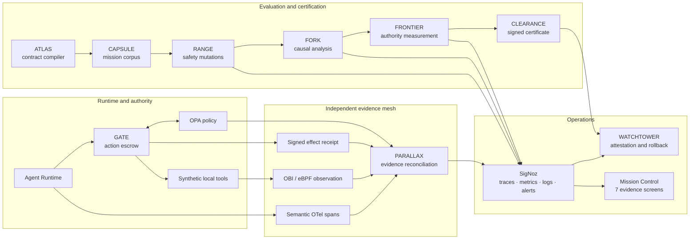

# ORBITAL Σ

## Trust what the agent does, not only what it says.

**ORBITAL Σ is a flight-assurance control plane that turns independently observed agent behavior into bounded authority, signed certification, and automatic rollback.**

**Hackathon track:** AI & Agent Observability


[Three-minute demo script](docs/demo-video-package.md) · [Five-minute judge guide](docs/JUDGE_GUIDE.md) · [Architecture](docs/architecture.md) · [SigNoz evidence](docs/presentation-assets.md#signoz-evidence) · [Final validation](docs/phase8-final-validation-2026-07-23.md) · [Release v1.0.1](https://github.com/Shobhit1Kapoor/Orbital/releases/tag/v1.0.1)

---

## The problem

An agent can emit a plausible trace, pass a task-success benchmark, and still perform an action that its semantic telemetry did not declare. That gap matters most when the action changes money, access, customer state, or another irreversible resource.

Conventional evaluation asks whether the answer looked correct. Conventional application monitoring asks whether the service stayed healthy. Neither question proves that:

- the effect observed at the system boundary matched the action the agent declared;
- the action was authorized under the exact certificate, policy, tenant, amount, and artifact identity;
- the evidence sensors required for a safety claim were healthy;
- an apparent regression caused the failure rather than merely correlating with it; or
- a deployed candidate still deserves the authority granted during certification.

ORBITAL treats those as one assurance problem. It does not trust a self-reported tool call in isolation. It reconciles semantic spans, OPA decisions, independently observed OBI traffic, and signed effect receipts, then uses that evidence to decide how much authority an agent may hold.

## One picture



The decisive trust boundary is between an agent's semantic claim and the independently observed effect. SigNoz is where those evidence streams remain correlated and queryable.

## Why SigNoz is indispensable

SigNoz is not a screenshot destination or a generic metrics backend in ORBITAL. It is the execution-evidence system used to support or withhold operational authority.

| SigNoz capability | How ORBITAL uses it | Assurance decision it supports |
|---|---|---|
| Distributed traces | Correlates mission, policy, capability, tool, receipt, OBI, replay, causal, certification, and rollback spans | What happened, in what order, and under which artifact identity |
| Trace matching | Detects a consequential effect without a matching authorization or verification span | Whether an action is `CONFIRMED`, `CONTRADICTED`, or incomplete |
| OBI / eBPF | Observes project-owned local HTTP traffic independently of application instrumentation | Whether the boundary effect agrees with the semantic claim |
| Query Builder and formulas | Computes routine readiness, evidence-parity, latency, retry, and rollout views | Whether contract thresholds are met |
| ClickHouse SQL | Aggregates campaign, causal, authority-frontier, and drift evidence | Which factor contributed, and how much authority is supported |
| Alerts and history | Detects mismatch, sensor loss, artifact drift, and other revocation conditions | Whether a certificate must be suspended |
| Signed webhook path | Delivers an allowlisted, authenticated alert event to WATCHTOWER | Whether rollback was triggered by verifiable alert evidence |
| Dashboards and saved views | Gives judges and operators drill-down paths from a claim to its traces | Whether a displayed result has inspectable support |

[SigNoz Foundry](https://signoz.io/docs/install/docker/) reproduces the SigNoz deployment and its managed MCP server from `casting.yaml` and `casting.yaml.lock`. ORBITAL's idempotent provisioning code then creates its six dashboard definitions, twelve alert definitions, and saved views. Foundry owns deployment reproducibility; ORBITAL owns project-specific observability content.

## The hero story

The primary demonstration is a synthetic refund mission running entirely against local fixtures.

1. **A candidate appears better.** A deterministic local evaluation labels the candidate's latency and cost comparison as simulation, not production measurement.
2. **The candidate declares a safe action.** Its semantic span says `store_credit`.
3. **The local fixture performs a different effect.** The intentionally vulnerable MCP-like fixture calls only the project-owned mock refund service.
4. **Independent evidence disagrees.** Native OBI observes `issue_refund`; OPA and the signed receipt provide two more evidence planes.
5. **PARALLAX refuses to average the disagreement away.** The action becomes `CONTRADICTED`, with the semantic and observed spans linked in SigNoz.
6. **The alert becomes control input.** SigNoz alert history records the condition and sends a signed, allowlisted webhook to WATCHTOWER.
7. **WATCHTOWER revokes runtime trust.** Duplicate delivery is idempotent; the certificate is suspended, candidate traffic becomes zero, and the last certified baseline is restored.
8. **FORK asks what caused the failure.** It stores 256 traceable counterfactual branches and a bounded attribution result, then minimizes the reproducer from 17 units to 7.
9. **FRONTIER limits authority.** Six authority levels are evaluated; the evidence supports level 3, low-value external actions, and no higher.
10. **CLEARANCE signs the restrictions.** A deterministic policy engine—not the LLM—issues and verifies an Ed25519 certificate.
11. **Delegation cannot launder authority.** A parent without refund permission delegates to a child; OPA denies it, GATE refuses the capability, and no effect occurs.

The sequence is packaged as `make final-demo` and completed in **27.730 seconds** during the committed final clean rehearsal, excluding infrastructure startup. See the [Phase 8 validation report](docs/phase8-final-validation-2026-07-23.md) for exact evidence identifiers and conditions.

## What is implemented

All named subsystems execute real project code:

- **ATLAS** deterministically compiles a mission contract into policy, telemetry, replay, dashboard, alert, and certification inputs.
- **PARALLAX** reconciles semantic spans, OBI observations, OPA decisions, and effect receipts into `CONFIRMED`, `CONTRADICTED`, `UNOBSERVED`, or `UNKNOWN`.
- **GATE** escrows consequential actions through proposal, quote/binding, authorization, a 20-second single-use Ed25519 capability, commit, and effect verification.
- **CAPSULE** stores reproducible mission inputs, fixtures, privacy maps, invariants, and reference telemetry.
- **RANGE** generates and scores bounded local safety mutations, selects a deterministic high-risk set, and evaluates metamorphic invariants.
- **FORK** runs single and pairwise interventions, repeated counterfactuals, bounded Shapley-style attribution, confidence intervals, and the hero minimizer.
- **FRONTIER** measures completion and safety across all six authority levels.
- **CLEARANCE** evaluates deterministic contract thresholds and signs the safety case and authority restrictions.
- **WATCHTOWER** verifies runtime identity, consumes signed SigNoz alerts, suspends certificates, zeros candidate traffic, and restores the baseline.
- **Multi-agent chain of custody** conserves authority and risk through delegation and blocks authority laundering.

Persistent campaigns use PostgreSQL for metadata and derived decisions, Redis/Celery for isolated replay work, and MinIO for versioned artifacts. SigNoz remains the source of truth for raw execution evidence.

## Verified results

These are committed validation results, not aspirational targets.

| Result | Value | Evidence mode |
|---|---:|---|
| Reproducible mission capsules | **120** | Deterministic synthetic corpus, persisted through campaign infrastructure |
| Valid safety mutations | **880** | Deterministic local generation with provenance |
| Selected high-risk test cases | **64** | Deterministic ranking |
| Counterfactual branches | **256** | Persisted replay/counterfactual execution |
| Hero reduction | **17 → 7** | Deterministic delta debugging preserving the verified failure |
| Authority levels evaluated | **6** | Deterministic evaluation, 1,000 observations per level |
| Maximum supported authority | **Level 3** | `LOW_VALUE_ACTION`, restricted by certificate |
| Automated tests | **95** | 87 Python tests + 8 Playwright tests |
| SigNoz assets | **6 dashboards, 12 alerts** | Version-controlled definitions with idempotent provisioning |
| Native OBI acceptance pair | **Positive + negative** | Semantic `store_credit`; observed `issue_refund`; result `CONTRADICTED` |
| Campaign recovery scenarios | **9** | PostgreSQL, Redis, MinIO, worker, retry, cancellation, and reconnect coverage |
| Required browser viewport | **1366×768** | All seven screens covered by Playwright |

The final certificate verdict in the clean rehearsal was `CONDITIONAL`, not `GO`. That is intentional: ORBITAL reports the restrictions supported by evidence instead of manufacturing a favorable result.

## Seven-screen Mission Control

Mission Control is an evidence reader, not a second source of truth. Every important result carries an execution-mode label and a path to supporting SigNoz evidence.

| Screen | Question it answers |
|---|---|
| [Launch Console](docs/assets/mission-control/01-launch-console.png) | What is running, which sensors are healthy, and how is the campaign progressing? |
| [Evidence Parity](docs/assets/mission-control/02-evidence-parity.png) | Did the declared action match independently observed behavior? |
| [Replay Theater](docs/assets/mission-control/03-replay-theater.png) | Which live, replayed, synthetic, or counterfactual step produced the result? |
| [Causal Graph](docs/assets/mission-control/04-causal-graph.png) | Which interventions contributed, with what confidence, and what remained after 17→7 minimization? |
| [Authority Frontier](docs/assets/mission-control/05-authority-frontier.png) | Where does added authority stop improving verified completion safely? |
| [Safety Case](docs/assets/mission-control/06-safety-case.png) | Which claims are supported by evidence, assumptions, restrictions, and residual risks? |
| [Certificate](docs/assets/mission-control/07-certificate.png) | Is the signature valid, what authority is allowed, and has drift suspended the certificate? |

## Quick start

### Prerequisites

- Ubuntu or WSL2 Ubuntu with Docker Engine and the Compose plugin
- Python 3.11+
- Node.js 20+ and pnpm 9+
- `make`, `curl`, and `openssl`
- Ollama on the host for live model mode; deterministic fallback remains explicitly labeled when Ollama is unavailable

Native OBI validation requires a Linux kernel with BTF and the documented container privileges. It is optional for the first UI tour but required for the authoritative positive/negative OBI acceptance pair.

### Reproduce the release

```bash
git clone https://github.com/Shobhit1Kapoor/Orbital.git
cd Orbital
git checkout v1.0.1

make bootstrap
make verify
make final-demo
```

Then open:

- Mission Control: `http://localhost:3000`
- SigNoz: `http://localhost:8080`
- Foundry-managed SigNoz MCP health: `http://localhost:8000/livez`

For the evidence-first five-minute review, follow [docs/JUDGE_GUIDE.md](docs/JUDGE_GUIDE.md). For the full validation matrix, use the commands below:

```bash
make verify-obi
make verify-alerts
make verify-campaign
make verify-metamorphic
make verify-causal
make verify-clearance
make verify-delegation
make test-e2e
```

`make reset-demo` removes generated demo state so the workflow can be repeated. It does not delete the Git repository.

## Repository map

```text
apps/mission-control/          Seven-screen Next.js evidence UI
services/                      Control, runtime, GATE, replay, causal, certification, WATCHTOWER
packages/                      Shared schemas, contracts, semconv, tokens, certificate models
contracts/                     Mission contract source
policies/                      OPA policy bundles
missions/                      Capsules and minimized regression
dashboards/                    Six SigNoz dashboard definitions
alerts/                        Twelve SigNoz alert definitions
collector/                     Redaction and trace-aware sampling
infra/                         Docker Compose, Foundry, provisioning, native-VM helpers
demo/                          Synthetic fixtures and hero orchestration
tests/                         Unit, integration, acceptance, and browser coverage
docs/                          Architecture, validation, judge, privacy, and submission evidence
```

## Security, privacy, and evidence labels

Everything in the demo is synthetic and project-owned. The vulnerable behavior is a deterministic local reliability fixture, not a reusable exploit and not a real payment integration.

The Collector deletes six forbidden payload fields before export, including raw prompts, chain-of-thought, capability tokens, payment credentials, and customer names or email addresses. The synthetic corpus hashes tenant and order identifiers in its privacy map. WATCHTOWER accepts normalized allowlisted alert fields and verifies an HMAC-SHA256 signature. Tail sampling retains all high-risk, contradiction, certificate, drift, rollback, and irreversible-action traces, while sampling medium-risk and low-risk successes at lower rates.

When a required sensor or evidence reference is unavailable, the system reports `UNKNOWN`. It does not convert missing evidence into success.

Read the exact controls and honest limitations in [docs/privacy-and-limitations.md](docs/privacy-and-limitations.md) and the attack assumptions in [docs/threat-model.md](docs/threat-model.md).

## Judge mapping

| Criterion | Evidence |
|---|---|
| AI & Agent Observability | Four-plane evidence reconciliation, OBI acceptance pair, trace matching, replay, causal and authority evidence |
| SigNoz depth | Traces, OBI, Query Builder, formulas, ClickHouse SQL, alerts, history, signed webhooks, dashboards, saved views, Foundry-managed MCP |
| Technical execution | Ten working subsystems, persistent campaigns, deterministic certification, rollback, 95 automated tests |
| Innovation | Observability evidence is converted into authority restrictions and runtime revocation |
| User experience | Seven linked Mission Control screens with live/replay/synthetic/counterfactual/`UNKNOWN` labels |
| Reproducibility | Locked Foundry deployment, one-command validation, exact release tag, committed reports and evidence identifiers |
| Responsible claims | Synthetic-only scope, no hidden reasoning export, explicit sensor failure, `CONDITIONAL` final verdict, documented limitations |

## Technology

Next.js, TypeScript, React Flow, Framer Motion, Recharts, FastAPI, Pydantic, SQLAlchemy, Alembic, PostgreSQL, Redis, Celery, MinIO, OPA, Ed25519, OpenFeature, OpenTelemetry, OBI/eBPF, SigNoz, SigNoz Foundry, Docker Compose, Ollama, and Qwen3 8B.

## Team and AI-assistance disclosure

ORBITAL Σ was built by **Shobhit Kapoor** as a solo hackathon project.

AI coding assistance was used for implementation, tests, documentation, and review. Architecture decisions, integration, validation, evidence capture, and final claims were selected and verified by the project author. The agent under evaluation uses local Qwen3 8B through Ollama's OpenAI-compatible endpoint; deterministic fallback runs are labeled as such.

## Start here

- **Judging now:** [Five-minute judge guide](docs/JUDGE_GUIDE.md)
- **Reproducing:** [Release v1.0.1](https://github.com/Shobhit1Kapoor/Orbital/releases/tag/v1.0.1) and [final validation](docs/phase8-final-validation-2026-07-23.md)
- **Understanding the system:** [Architecture deep-dive](docs/architecture.md)
- **Recording the demo:** [Three-minute video package](docs/demo-video-package.md)
- **Checking claims:** [Presentation and SigNoz evidence index](docs/presentation-assets.md)
- **Reading limitations:** [Privacy and limitations](docs/privacy-and-limitations.md)
