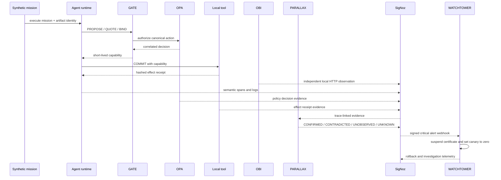

# ORBITAL Σ Architecture

## Assurance flow



## Service boundaries

| Subsystem | Implementation boundary | Durable evidence |
|---|---|---|
| ATLAS | control plane + mission-contract SDK | normalized contract, Rego/data, query and alert specs |
| PARALLAX | evidence reconciler + Collector + OBI | claims, trace IDs, parity state |
| GATE | action gateway + local tools | policy decisions, nonces, capability and effect receipts |
| CAPSULE | capsule builder | PostgreSQL metadata, versioned MinIO artifacts |
| RANGE | adversarial foundry | deterministic mutations, provenance, ranking manifest |
| Metamorphic testing | replay orchestration | invariant outcomes and before/after evidence |
| FORK | causal engine + workers | branches, intervals, attribution, minimized regression |
| FRONTIER | certifier | six-level statistical evaluation |
| CLEARANCE | certifier | Ed25519 certificate and safety-case graph |
| WATCHTOWER | runtime service + SigNoz relay | attestations, suspensions, rollbacks, investigations |

SigNoz is authoritative for raw execution evidence. PostgreSQL stores metadata, trace references, and derived decisions; it does not replace telemetry.

## Correlation contract

Every mission, replay, policy decision, capability, receipt, causal branch, and certificate is correlated with:

```text
mission_id
trace_id
span_id
action_id
candidate_id
artifact_digest
certificate_id
```

All versioned schemas also carry `schema_version`, `created_at`, and a canonical SHA-256 digest.

## Runtime topology

- `infra/docker-compose.yaml` starts the application and persistence plane.
- `casting.yaml` plus `casting.yaml.lock` reproduces SigNoz through Foundry.
- The OpenTelemetry Collector applies privacy controls and risk-adaptive tail sampling.
- OBI runs with host PID access and eBPF privileges only on the native Ubuntu demo host.
- Ollama/Qwen3 remains on the RTX laptop; the VM uses the OpenAI-compatible endpoint or labeled deterministic fallback.
