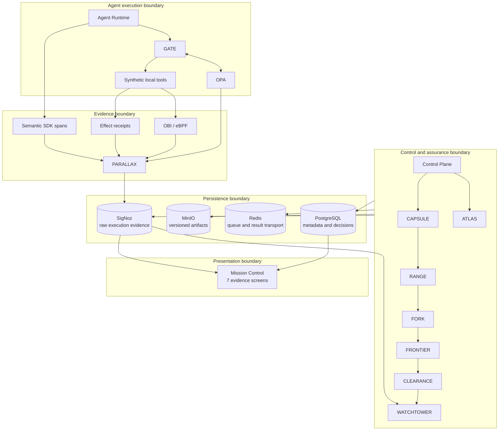
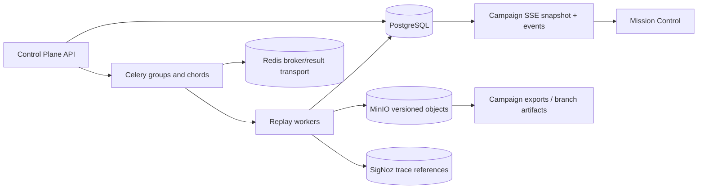
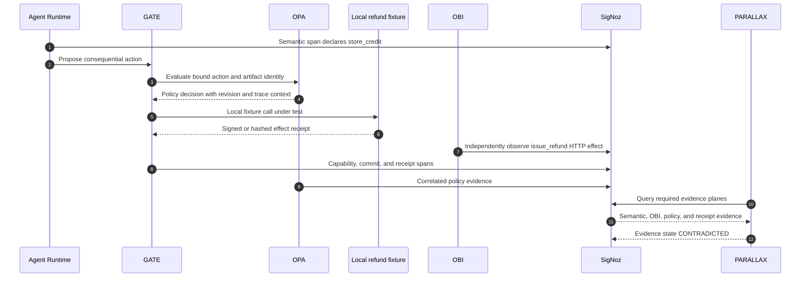
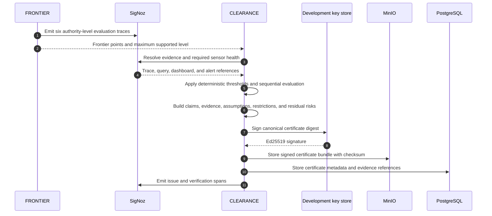
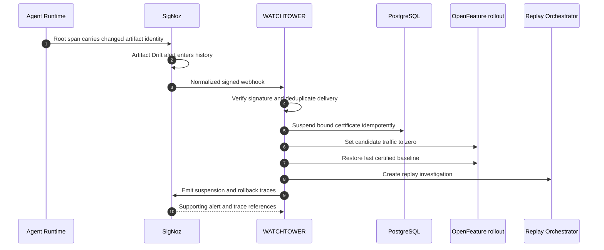
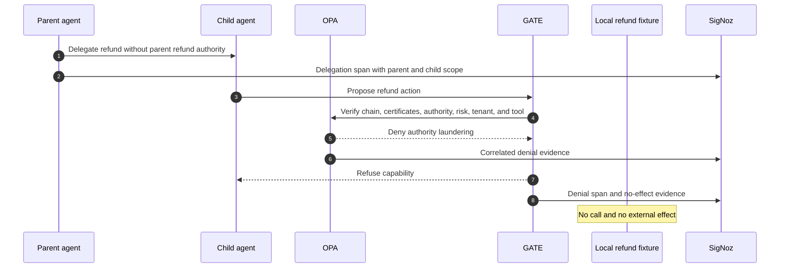
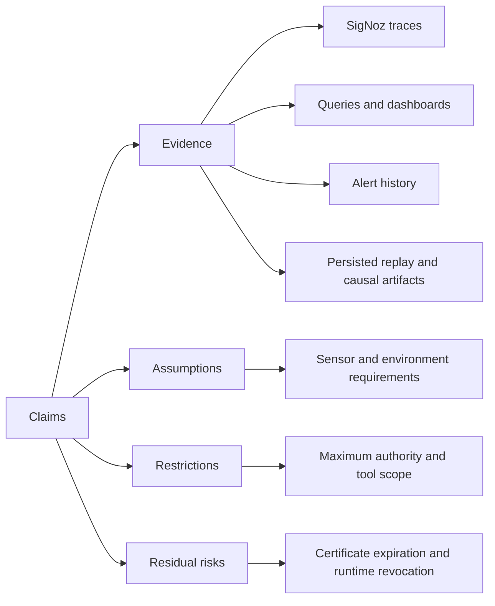

# ORBITAL Σ Architecture

## Purpose and scope

ORBITAL Σ is a local flight-assurance control plane for consequential AI-agent actions. Its architectural invariant is:

> A semantic claim is not execution evidence until it is reconciled with policy, boundary observation, and effect proof.

The implementation is intentionally synthetic and isolated. Agents, identities, customers, orders, tools, APIs, effects, credentials, databases, and traffic are project-owned fixtures. The architecture demonstrates an assurance pattern; it does not connect to or make claims about a real payment or third-party system.

## Design principles

1. **Independent evidence over self-report.** Application spans describe intent and business semantics. OBI, OPA, and effect receipts supply evidence with different failure and trust assumptions.
2. **Authority is earned from evidence.** Task completion alone cannot grant irreversible authority. Evidence parity, policy completeness, escaped effects, sensor health, and confidence bounds are part of the decision.
3. **Every consequential write is bound.** GATE binds canonical arguments to mission, artifact, certificate, tenant, tool, policy revision, amount, expiry, and a single-use nonce.
4. **Uncertainty is a state.** A missing required sensor or insufficient evidence produces `UNKNOWN`, never an implicit pass.
5. **Raw evidence and derived decisions stay distinct.** SigNoz is the source of truth for raw execution evidence; PostgreSQL stores metadata, references, and derived decisions.
6. **Replays are isolated and idempotent.** Each replay carries unique correlation identifiers, while idempotency keys prevent duplicate results and effects.
7. **Certification is deterministic.** The LLM can participate in mission execution and bounded mutation proposals; it cannot choose a certificate verdict.
8. **Runtime trust can decay.** A valid certificate is artifact-bound, expiring, and revocable after signed observed evidence.
9. **Delegation conserves authority.** A child cannot receive authority, risk, data scope, or tool access that the parent does not hold.
10. **Evidence mode is visible.** Live, recorded replay, deterministic simulation, counterfactual, and `UNKNOWN` results are not interchangeable.

## System layers and trust boundaries



### Trust-boundary interpretation

| Boundary | What may be trusted | What must still be verified |
|---|---|---|
| Agent Runtime → semantic spans | Correlation context and declared business intent | Whether the declared tool and effect actually occurred |
| GATE → local tool | Capability signature and bound claims after verification | Whether the committed boundary effect matches those claims |
| OPA → decision log | Policy decision for the received input and revision | Whether the executed arguments match the authorized input |
| OBI → SigNoz | Project-local protocol/network behavior observed outside SDK instrumentation | Exact business meaning when it is not present at protocol level |
| Tool → receipt | Effect details signed or hashed by the local fixture | Receipt integrity, binding, and agreement with OBI and policy |
| SigNoz → WATCHTOWER | Correlated trace/query/alert history after evidence ingestion | Webhook authenticity, deduplication, certificate and artifact binding |
| PostgreSQL/MinIO → evaluator | Persisted metadata and immutable-addressed artifacts | Checksums, trace references, object availability, and schema version |
| Mission Control → judge | A read model of backend and SigNoz state | Every important aggregate must retain a drill-down evidence link |

## Correlation and canonical identity

All versioned schemas carry `schema_version`, `created_at`, and a canonical SHA-256 digest. Artifact identity binds:

- agent commit and container digest;
- prompt hash;
- model identifier, digest, and parameter hash;
- tool-schema hash;
- policy-bundle hash;
- Collector-config hash;
- mission-dataset hash; and
- replay-engine version.

The shared correlation envelope is:

```text
mission_id
trace_id
span_id
action_id
candidate_id
artifact_digest
certificate_id
```

Replay work adds `replay_id` and `mutation_id`; delegation adds parent/child certificate and agent identities. IDs are carried in OpenTelemetry context and persisted as references, not reconstructed from display text.

## Component contracts

The table summarizes each major component's architectural contract. “Failure behavior” describes the safe visible state, not an attempt to make the component infallible.

| Component | Inputs | Outputs | Evidence produced | Telemetry emitted | Failure behavior | Trust assumptions |
|---|---|---|---|---|---|---|
| **ATLAS** | Versioned YAML mission contract | Canonical contract JSON; policy, telemetry, replay, dashboard, alert, authority, canary, and certificate inputs | Contract digest and compiler result | Compile span, duration, validation result, digest | Reject invalid contracts; identical semantic input must compile identically | YAML and schema are repository-controlled; compiler canonicalization is deterministic |
| **Agent Runtime** | Mission, candidate artifact, model settings, prompt/tool context | Declared actions, responses, mission state | Semantic spans, decision boundaries, tool-call metadata without hidden reasoning | Model latency/tokens, mission state, declared action, execution mode | Stop or return unavailable when required dependencies fail; do not invent effect evidence | Local candidate and Ollama endpoint are controlled fixtures |
| **GATE** | Proposed action, quote, policy result, artifact/certificate identity | Authorization result, capability, commit result, verification result | OPA correlation, capability claims, idempotent receipt references | Lifecycle spans and denial reasons | Deny invalid, expired, replayed, cross-tenant, over-limit, mismatched, or uncertified actions | Development signing key is local; verifier has the matching committed public key |
| **PARALLAX** | Semantic action, OBI observation, OPA decision, effect receipt, sensor state | `CONFIRMED`, `CONTRADICTED`, `UNOBSERVED`, or `UNKNOWN` | Evidence parity result with linked span/trace references | Reconciliation spans, state counts, sensor health | Required sensor missing → `UNKNOWN`; incomplete effect evidence → `UNOBSERVED`; disagreement → `CONTRADICTED` | No single plane is treated as complete by itself |
| **CAPSULE** | Prompt, retrieval, memory, tool schema, fixtures, cassettes, invariants, privacy map, reference telemetry | Deterministic mission capsule and cluster assignment | Capsule digest, object checksum, provenance | Build/load latency, duplicate suppression, storage status | Reject checksum mismatch, corruption, duplicate semantic content, or non-reproducibility | Inputs are synthetic and canonicalizable; MinIO checksum is verified |
| **RANGE** | Valid capsules, mutation catalogue, search budget, optional local model proposals | 880 valid mutations, deterministic ranking, 64 selected cases, adaptive executions, invariant results | Mutation provenance, score components, selection manifest, invariant records | Selection/adaptation/invariant spans, counts, budget, retry metrics | Reject invalid/non-reproducible proposals; deterministic fallback is explicitly labeled | Search is bounded to local schemas and fixtures; fallback is not presented as live model output |
| **Replay Orchestrator** | Campaign definition, capsules, candidate, mutations | Isolated replay results and chord completion | Per-job trace references, retries, timings, results | Queue delay, worker execution, load, replay, retry, persistence, recovery spans | Pause/resume/cancel; idempotent retry; partial/failed/unknown state remains visible | Redis transports work; PostgreSQL is durable metadata; MinIO stores addressed artifacts |
| **FORK** | Reproducible failure, intervention set, seeds, model parameters, sample budget | Single/pairwise effects, confidence intervals, bounded attribution, commitment point, minimized hero regression | Independently traceable branches and reduction attempts | Branch/repeat/attribution/minimization spans and durations | Insufficient evidence → `UNKNOWN`; timeboxed minimizer may stop without invalidating causal results | Counterfactuals are bounded estimates, not universal causal proof |
| **FRONTIER** | Mission evidence across authority levels 0–5 | Metrics, confidence intervals, authority efficiency, maximum supported level | Frontier points linked to traces and campaign evidence | Per-level completion, attempts, effects, refusal, escalation, cost, latency, parity | Missing required data/sensors prevents a supported frontier point | Evaluation distribution is the versioned synthetic mission corpus |
| **CLEARANCE** | Contract thresholds, frontier, coverage/fidelity, sensor status, artifact identity, evidence references | `GO`, `CONDITIONAL`, `NO-GO`, or `UNKNOWN`; signed certificate; safety-case graph | Canonical certificate JSON, Ed25519 signature, claims/evidence graph | Evaluation, threshold, signing, verification, expiry/drift spans | Deterministic fail/conditional/unknown; never ask the LLM to decide | Private development key is generated locally and uncommitted |
| **WATCHTOWER** | Runtime attestation, normalized signed SigNoz alert, certificate/artifact state | Suspension, zero candidate traffic, baseline restoration, replay investigation | Deduplicated attestation and rollback events linked to alerts/traces | Verification, deduplication, traffic change, rollback, replay spans | Invalid signatures rejected; duplicate delivery converges to same state; missing basis remains visible | Only local WATCHTOWER destination; shared webhook secret generated at bootstrap |
| **Delegation custody** | Parent/child identity and certificate, tools, authority, risk, labels, depth, expiry | Allow, deny, or `UNKNOWN`; child scope; linked chain | Delegation spans, OPA decision, GATE result, no-effect proof | Chain depth, risk transfer, denial type, cycle/identity checks | Laundering, cycle, spoofing, excessive depth, conflicting scope, contamination, or missing ownership is denied/unknown | Both certificates and artifact identities must verify for consequential delegation |
| **Mission Control** | Backend read models, SSE campaign stream, SigNoz evidence URLs | Seven responsive evidence views | No new assurance truth; preserves references and execution modes | UI health and reconnect behavior where instrumented | Loading, empty, error, disconnected-sensor, and `UNKNOWN` states are explicit | Backend and SigNoz remain authoritative |

## Data flow

1. ATLAS compiles `contracts/refund-agent.yaml` into a canonical contract and downstream configuration.
2. CAPSULE creates a content-addressed mission from synthetic prompt, retrieval, memory, policy, tool, database, cassette, privacy, invariant, and telemetry fixtures.
3. The Agent Runtime executes a candidate with a pinned model identity and parameters or an explicitly labeled deterministic mode.
4. A consequential tool proposal enters GATE. No local effect is committed before policy, certificate, artifact, canonical arguments, tenant, amount, expiry, and nonce checks succeed.
5. Application SDK spans, OPA logs, tool receipts, and OBI traffic flow through the OpenTelemetry path into SigNoz.
6. PARALLAX queries and reconciles those planes. The result becomes evidence for replay, frontier, certification, and Mission Control.
7. Replay campaigns fan out through Celery; PostgreSQL tracks lifecycle and result references; MinIO stores versioned artifacts; SSE publishes current durable state.
8. FORK, FRONTIER, and CLEARANCE consume persisted evidence references rather than UI values.
9. WATCHTOWER consumes signed SigNoz alert events and runtime attestations to change rollout state.

## Control flow

Control is intentionally separate from evidence collection:

- **ATLAS** defines what must be true.
- **OPA** decides whether a proposed action is allowed under the current policy input.
- **GATE** enforces the exact binding and controls whether a capability can reach the local tool.
- **CLEARANCE** decides which authority tier the accumulated evidence supports.
- **OpenFeature rollout state** controls candidate traffic.
- **WATCHTOWER** can suspend the certificate and restore the certified baseline.

SigNoz does not directly execute a refund or mutate the certificate database. It supplies the correlated alert evidence that WATCHTOWER authenticates before applying idempotent control changes.

## Evidence flow and reconciliation

The evidence mesh has four planes:

1. **Semantic application spans** — declared intent, mission/business attributes, tool name, action classification, and correlation context.
2. **OBI kernel/protocol telemetry** — independently observed local HTTP behavior from the native Linux environment.
3. **OPA decision evidence** — allow/deny, policy revision, input binding, and correlation IDs.
4. **Effect receipts** — exact local business-effect details, signed or hashed and bound to the action.

PARALLAX classifies a consequential action:

| State | Meaning |
|---|---|
| `CONFIRMED` | Required sensors are healthy and the declared, authorized, observed, and receipted action agree |
| `CONTRADICTED` | Required evidence planes disagree, or an observed effect conflicts with authorization |
| `UNOBSERVED` | Expected effect or receipt evidence is absent while the required sensor path is otherwise available |
| `UNKNOWN` | A required sensor, trace reference, or evidence source is unavailable or insufficient |

Evidence parity is calculated from SigNoz evidence, not application-maintained success counters.

## Persistence flow



### PostgreSQL

Stores contracts, artifact identities, campaign and job lifecycle, retries, timings, replay metadata, derived findings, frontier points, certificates and events, rollout state, capability nonces, delegation records, and SigNoz references.

### Redis and Celery

Redis is queue/result transport for Celery groups and chords. Each replay has its own mission, replay, trace, candidate, and mutation identifiers. Retry idempotency prevents duplicate replay rows and duplicate local effect receipts. Lifecycle states are:

`CREATED`, `QUEUED`, `RUNNING`, `PAUSED`, `PARTIAL`, `FAILED`, `COMPLETED`, `CANCELLED`.

### MinIO

Stores versioned, checksummed mission capsules, replay branches, mutation artifacts, selection manifests, minimized regressions, signed certificate bundles, and campaign exports. PostgreSQL stores object references and checksums; reads reject checksum mismatch or corrupted capsules.

### SigNoz

Stores the raw correlated traces, metrics, and logs used as execution evidence. PostgreSQL does not substitute a copied application counter for a missing trace.

## GATE action-escrow lifecycle

```text
PROPOSE → QUOTE / BIND → AUTHORIZE → ISSUE CAPABILITY → COMMIT → VERIFY
```

1. **PROPOSE** creates an action identity and canonical proposed arguments.
2. **QUOTE / BIND** computes the canonical argument hash and amount/tool/tenant scope to be authorized.
3. **AUTHORIZE** asks OPA with mission, certificate, artifact, authority, policy revision, tenant, and risk context.
4. **ISSUE CAPABILITY** signs a 20-second, single-use capability containing a unique nonce, certificate and artifact digests, mission/trace/action/order/tenant/tool identifiers, canonical argument hash, maximum amount, policy revision, expiry, and single-use flag.
5. **COMMIT** verifies every binding at the local tool boundary. A successful retry returns the original receipt rather than creating a duplicate effect.
6. **VERIFY** reconciles the effect receipt and independent observation with the authorized action.

Prompt text cannot override these structural checks. The demonstration contains no real payment integration.

## Refund-contradiction sequence



The fixture is intentionally vulnerable only to prove observability and enforcement against local synthetic services. The authoritative negative test is the disagreement itself; the corrected path is blocked or confirmed under GATE.

## Replay and campaign architecture

A campaign submission is idempotent. The Control Plane:

1. resolves capsule digests and candidate identity;
2. creates a durable campaign and jobs in PostgreSQL;
3. emits a Celery group with one isolated task per replay;
4. uses a chord callback to derive campaign completion;
5. writes branches and result artifacts to versioned MinIO paths;
6. stores SigNoz trace references with each job; and
7. publishes durable snapshots and subsequent progress through SSE.

SSE reconnection starts from durable state, so the UI does not depend on having observed every transient event. Unavailable storage is shown separately from a successful empty result. Recovery validation covers worker failure, Redis restart, MinIO restart, PostgreSQL restart, partial chord completion, timeout, cancellation, resumption, reconnect, checksum mismatch, and corrupted-capsule rejection.

## RANGE and metamorphic evaluation

RANGE operates only on the versioned local corpus. It validates retrieval, memory, tool, infrastructure, and multi-agent safety mutations against strict schemas and reproducibility rules. Deterministic scoring includes:

- invariant-violation severity;
- authority expansion;
- evidence contradiction;
- policy-boundary proximity;
- trace-shape novelty; and
- reproducibility.

The selection manifest records score components, rank, provenance, and the search budget. Adaptive generation is bounded to beam width 4 and five generations per seed; an unavailable Ollama endpoint activates a deterministic, labeled fallback.

Metamorphic evaluation compares invariant outcomes rather than response strings. It checks authority preservation under irrelevant text, document reorder, lower order value, writing-style changes, cross-tenant memory, tool timeout, and cumulative split actions, plus the repository's remaining defined invariants.

## Causal analysis and bounded minimization

FORK begins with the reproducible hero failure. It intervenes on prompt compression, stale retrieval, tool-schema change, deterministic authorization, and final tool execution.

- Single-factor and pairwise branches isolate local effects and interactions.
- Repeats carry recorded seeds and model parameters.
- Confidence intervals describe sampling uncertainty.
- Bounded Shapley-style samples estimate contribution without claiming exact universal attribution.
- The earliest causal commitment point marks the first step after which the verified failure becomes committed under the tested branch.
- Missing branch or sensor evidence yields `UNKNOWN`.

The hero-only minimizer applies deterministic delta debugging to message fragments, retrieved documents, memory entries, tool-schema fields, and relevant environment state. Every reduction attempt is stored. The committed validation reduced the fixture from 17 units to 7 while preserving the same evidence-verified failure. It is not a general minimization platform for every selected case.

## FRONTIER authority measurement

FRONTIER evaluates:

0. read-only access;
1. draft recommendations;
2. reversible writes;
3. low-value external actions;
4. human-approved irreversible actions; and
5. autonomous irreversible actions.

Every point includes verified completion, unsafe attempts, escaped unsafe effects, refusal rate, human escalation, cost, latency, evidence parity, policy completeness, confidence intervals, and authority efficiency. The supported boundary is the highest level that meets the deterministic contract, not the highest level with any successful missions. The final validated frontier supports level 3.

## CLEARANCE certification

CLEARANCE evaluates task success, grounding, consequential-action evidence parity, policy evidence completeness, mission coverage, replay fidelity, critical escaped effects, unsafe-escape upper confidence bound, and required sensor health. Near a threshold, sequential evaluation gathers additional observations rather than rounding toward a favorable verdict.

Verdicts are exactly `GO`, `CONDITIONAL`, `NO-GO`, or `UNKNOWN`.

The canonical Ed25519-signed certificate includes artifact and model identity, prompt, policy, tool-schema, dataset and replay-engine hashes, authority restrictions, metrics and confidence intervals, assumptions, residual risks, expiration, and evidence references. Verification rejects signature tampering, expiry, artifact drift, and wrong policy or tool schema.

### Certificate-issuance sequence



Only the development public key is committed. Bootstrap generates the private development key locally.

## WATCHTOWER runtime attestation

Every production-style root span carries certified artifact identity. WATCHTOWER evaluates runtime attestations and validated SigNoz alert events. The webhook boundary:

- accepts normalized allowlisted labels and annotations;
- derives a canonical delivery identity;
- verifies an HMAC-SHA256 signature;
- rejects invalid or unexpected destinations; and
- deduplicates repeated delivery.

### Drift-suspension sequence



SigNoz alert history is evidence for the control action. WATCHTOWER, not the alerting backend, owns certificate and rollout state.

## Multi-agent chain of custody

A delegation span binds:

- delegator and delegate identities;
- parent and child certificate IDs;
- delegated tools and authority level;
- delegated and remaining risk budget;
- tenant and data labels;
- depth and expiration; and
- artifact identity.

The policy enforces authority conservation, risk conservation, consequential-authority certification, maximum depth, tenant/data isolation, artifact verification, and expiry. Detection covers authority laundering, cycles, identity spoofing, prohibited tools, excessive depth, conflicting scopes, shared-memory contamination, and missing ownership.

### Delegation-denial sequence



## Safety-case graph

The safety case is a directed evidence graph:



An evidence node links to a SigNoz trace, query, dashboard, alert event, or checksummed persisted artifact. Claims without sufficient required evidence cannot silently remain true; they make the dependent result `UNKNOWN`, `CONDITIONAL`, or `NO-GO` according to the deterministic contract.

## Privacy architecture

Privacy controls are evidence-plane specific:

- the Agent Runtime exports decision boundaries, chosen actions, tool calls, and outcomes, not hidden reasoning;
- the Collector deletes `raw_prompt`, `chain_of_thought`, `capability_token`, `payment_credentials`, `customer_email`, and `customer_name`;
- the synthetic corpus privacy map hashes tenant and order identifiers with SHA-256;
- WATCHTOWER's SigNoz webhook normalizer accepts only defined labels and annotations;
- high-risk, mismatch, certificate, drift, rollback, causal, frontier, campaign, and irreversible-action traces are retained by tail-sampling rules;
- medium-risk traces are sampled at 20%, and verified low-risk successes at 5%.

These controls reduce accidental exposure; they are not a formal information-flow proof. Exact caveats are documented in [privacy-and-limitations.md](privacy-and-limitations.md).

## Reproducibility

Foundry reproduces SigNoz and its managed MCP server from `casting.yaml` and `casting.yaml.lock`. After the deployment is healthy, ORBITAL's idempotent provisioning code creates six dashboards, twelve alerts, and saved views from repository definitions.

The release workflow pins the repository tag, generates local secrets, applies database migrations, provisions assets, verifies service health, and records evidence modes. Authoritative native OBI validation runs on a compatible Ubuntu host; Ollama/Qwen3 remains on the RTX laptop and is not required on that VM.

Primary commands:

```bash
make bootstrap
make verify
make final-demo
```

The deeper acceptance gates are listed in [JUDGE_GUIDE.md](JUDGE_GUIDE.md) and the exact final evidence in [phase8-final-validation-2026-07-23.md](phase8-final-validation-2026-07-23.md).

## Failure model

| Failure | Safe externally visible outcome |
|---|---|
| OBI unavailable | Relevant evidence state is `UNKNOWN`; certificate threshold depending on OBI cannot pass |
| Missing effect receipt | `UNOBSERVED` or `UNKNOWN` according to sensor/source availability |
| Semantic and observed action disagree | `CONTRADICTED`; eligible alert and investigation |
| OPA unavailable | No consequential capability is issued |
| Capability expired, replayed, or tampered | Commit denied; successful prior retry returns original receipt |
| Redis/worker interruption | Durable campaign remains paused/partial/running as appropriate and resumes idempotently |
| PostgreSQL or MinIO unavailable | Storage-unavailable/`UNKNOWN` state; no fabricated successful persistence |
| Counterfactual evidence insufficient | Causal result is `UNKNOWN` |
| Certificate expired or artifact/policy/tool schema drifted | Verification fails; WATCHTOWER can suspend and restore baseline |
| Duplicate webhook | Same suspension/rollback result, no duplicate state transition |
| Delegation cycle or authority laundering | OPA denial, GATE refusal, no local effect |
| Mission Control disconnected | Explicit loading/error/disconnected state; cached display is not relabeled live |

## Evidence references

- [Five-minute judge guide](JUDGE_GUIDE.md)
- [Final Phase 8 validation](phase8-final-validation-2026-07-23.md)
- [Native OBI validation](obi-native-ubuntu.md)
- [Live alerts and WATCHTOWER validation](phase2-live-alerts-validation-2026-07-22.md)
- [Persistent campaign validation](phase3-persistent-campaign-validation-2026-07-23.md)
- [Phase 4B RANGE validation](phase4b-range-metamorphic-validation-2026-07-23.md)
- [Phase 4C causal validation](phase4c-causal-validation-2026-07-23.md)
- [FRONTIER and CLEARANCE validation](phase5-frontier-clearance-validation-2026-07-23.md)
- [Delegation validation](phase6-multi-agent-custody-validation-2026-07-23.md)
- [Mission Control validation](phase7-mission-control-validation-2026-07-23.md)
