# ORBITAL Σ Presentation Asset Index

## Use policy

Every image in this index is either:

- a captured project state from the validated local environment;
- a source-controlled architecture diagram; or
- a caption source for the planned recording.

No asset is stock footage and no screenshot represents a third-party production system. Mission Control captures may contain live, replay, synthetic, deterministic-simulation, counterfactual, and `UNKNOWN` cards together; the mode label shown inside the UI is authoritative. When an image is used without a live environment, call it **captured evidence**, not a live result.

Refresh the application and SigNoz captures only from an actual project run:

```bash
make final-demo
make capture-assets
make capture-signoz-assets
```

Do not manually edit result values into a screenshot. If a dependency is unavailable, retain its visible unavailable/`UNKNOWN` state or use the last validated capture with a clear capture label.

## Hero recommendation

Use [Evidence Parity](assets/mission-control/02-evidence-parity.png) as the README, submission, and first technical slide image. It communicates the central claim without narration: semantic `store_credit`, independently observed `issue_refund`, and `CONTRADICTED`.

Suggested presentation sequence:

1. Evidence Parity
2. SigNoz evidence trace
3. SigNoz alert history
4. Certificate rollback state
5. Causal Graph
6. Authority Frontier
7. Safety Case

## Architecture

| Filename | Preview / link | Purpose | Evidence mode | Capture or refresh note | Recommended use |
|---|---|---|---|---|---|
| `docs/assets/orbital-architecture.mmd` | [Editable Mermaid source](assets/orbital-architecture.mmd) | Compact system overview from Mission Control through assurance, runtime, persistence, SigNoz, and WATCHTOWER | Conceptual architecture, not execution evidence | Keep component names and dashboard count synchronized with [architecture.md](architecture.md); render with a Mermaid-compatible viewer after edits | Architecture slide, backup diagram source |

The canonical detailed architecture diagrams live in [architecture.md](architecture.md), including trust boundaries and four execution sequences.

## Mission Control

| Filename | Preview / link | What it proves or explains | Evidence mode shown | Capture or refresh note | Recommended use |
|---|---|---|---|---|---|
| `docs/assets/mission-control/01-launch-console.png` | [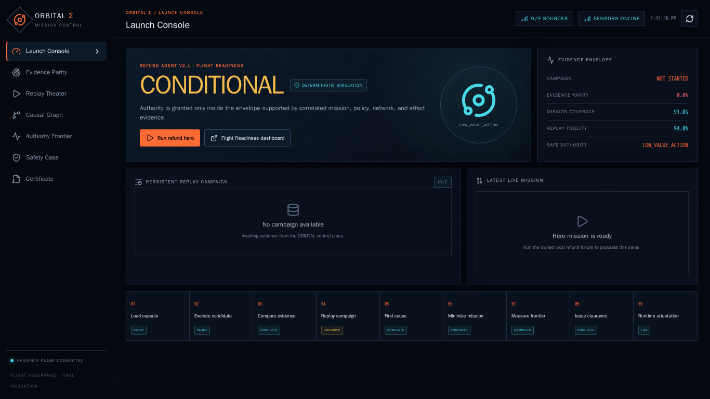](assets/mission-control/01-launch-console.png) | Sensor health, candidate comparison, campaign status, and entry into the hero flow | Mixed summary; each result card carries its own mode | Capture after `make final-demo` with health and SSE state visible; do not crop away mode labels | Opening demo frame; reproducibility slide |
| `docs/assets/mission-control/02-evidence-parity.png` | [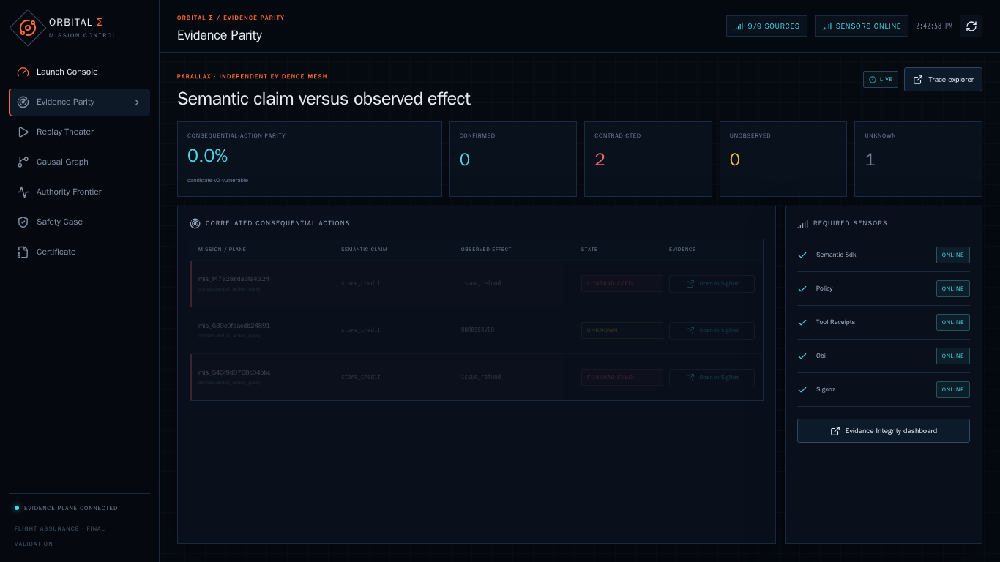](assets/mission-control/02-evidence-parity.png) | Semantic action versus independent observation and the `CONTRADICTED` result | Captured local evidence; supporting mode appears in UI | Refresh only after the semantic and OBI evidence are both queryable; sensor absence must remain `UNKNOWN` | README hero; problem/solution slide |
| `docs/assets/mission-control/03-replay-theater.png` | [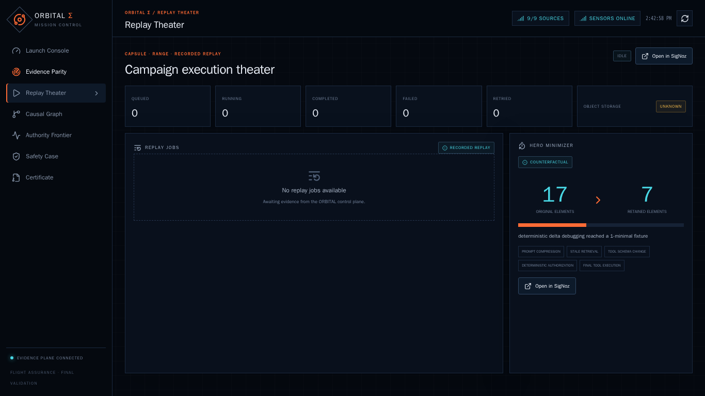](assets/mission-control/03-replay-theater.png) | Ordered mission, authorization, effect, evidence, and replay steps | Live, recorded replay, synthetic, and counterfactual labels | Capture after the replay investigation completes; keep the timeline and status legend readable | Demo transition from incident to investigation |
| `docs/assets/mission-control/04-causal-graph.png` | [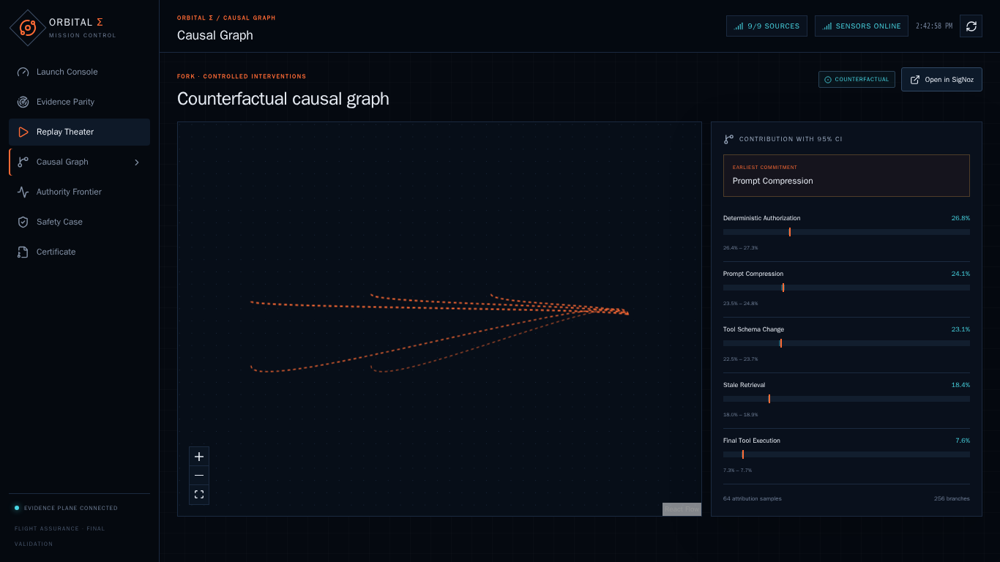](assets/mission-control/04-causal-graph.png) | Causal contribution intervals, earliest commitment point, and 17→7 minimization | Counterfactual analysis backed by persisted branches | Capture after `make causal-analysis` and `make minimize-hero-failure`; do not imply exact universal causality | Causal innovation slide |
| `docs/assets/mission-control/05-authority-frontier.png` | [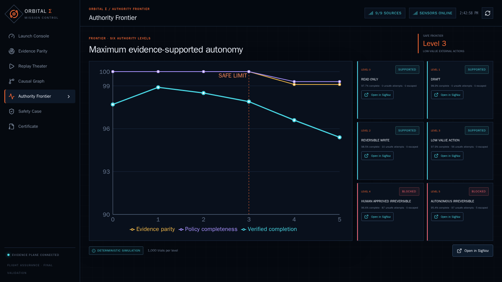](assets/mission-control/05-authority-frontier.png) | Six evaluated authority levels and the supported level-3 boundary | Deterministic evaluation of synthetic missions | Capture after `make authority-frontier`; show levels 0–5 and uncertainty/restriction context | Authority decision slide |
| `docs/assets/mission-control/06-safety-case.png` | [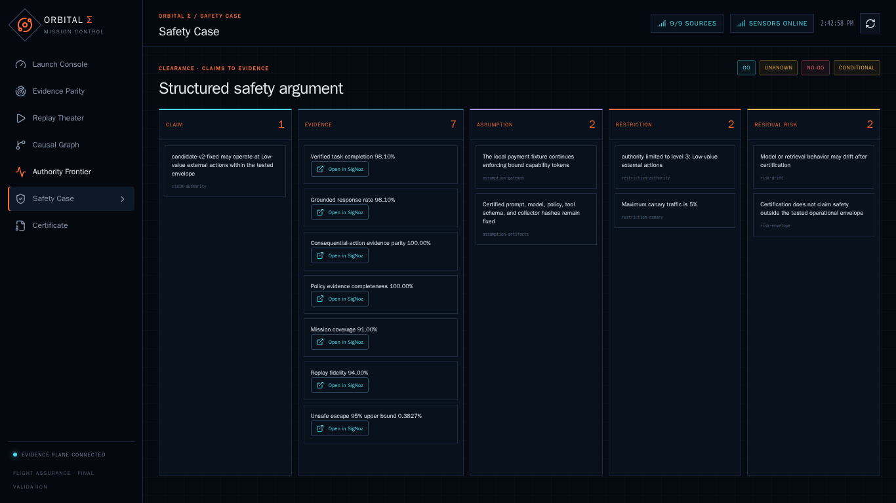](assets/mission-control/06-safety-case.png) | Claims linked to evidence, assumptions, restrictions, and residual risks | Derived deterministic certification evidence | Capture after `make certify-full`; expand at least one evidence-backed claim | Trust and explainability slide |
| `docs/assets/mission-control/07-certificate.png` | [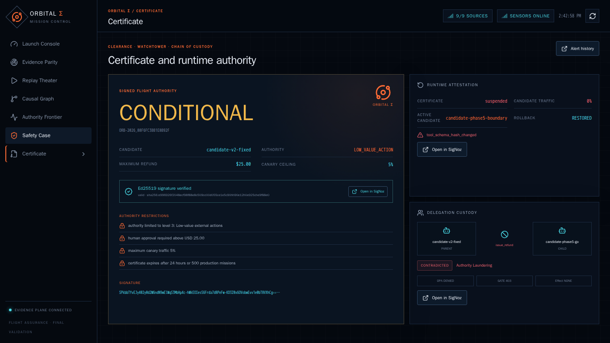](assets/mission-control/07-certificate.png) | `CONDITIONAL` verdict, signature, authority restrictions, suspension, zero traffic, baseline restoration, and delegation denial | Signed certificate plus captured runtime attestation/rollback state | Capture after alert acceptance and delegation demo; signature status and restriction must remain visible | Climax/final technical slide |

### Mission Control validation

- All seven routes were covered at 1366×768.
- Playwright validated the refund hero, contradiction, causal replay, authority certificate, drift rollback, delegation denial, and SSE reconnect behavior.
- Final automated browser total: **8 tests**.

Source: [Phase 7 Mission Control validation](phase7-mission-control-validation-2026-07-23.md) and [Phase 8 final validation](phase8-final-validation-2026-07-23.md).

## SigNoz evidence

| Filename | Preview / link | What it proves or explains | Evidence mode | Capture or refresh note | Recommended use |
|---|---|---|---|---|---|
| `docs/assets/signoz/01-evidence-trace.png` | [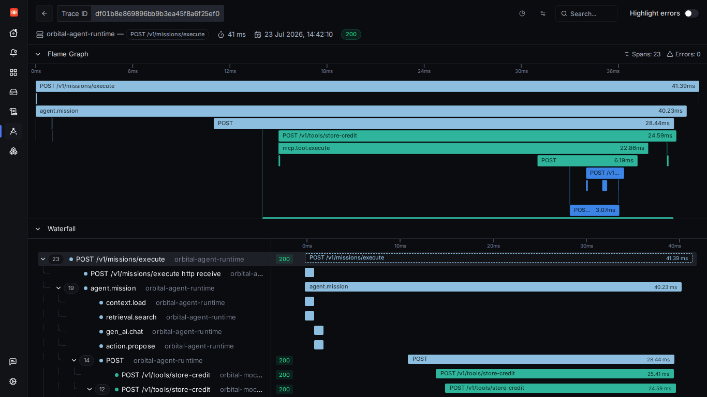](assets/signoz/01-evidence-trace.png) | Correlated semantic, policy, tool/receipt, and OBI evidence for the refund contradiction | Captured live local telemetry | Refresh from the new hero trace after `make final-demo`; record the fresh trace ID separately | Primary SigNoz proof |
| `docs/assets/signoz/02-flight-readiness-dashboard.png` | [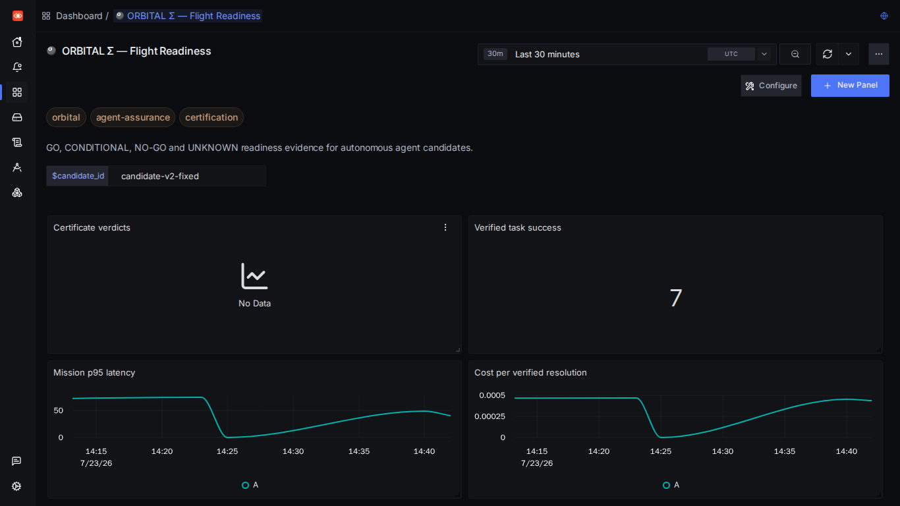](assets/signoz/02-flight-readiness-dashboard.png) | Readiness, evidence parity, sensor, and operational aggregates from repository queries | Captured live query results over local telemetry | Refresh after dashboard provisioning and a complete demo; retain query time range | SigNoz depth and operations slide |
| `docs/assets/signoz/03-trace-funnel.png` | [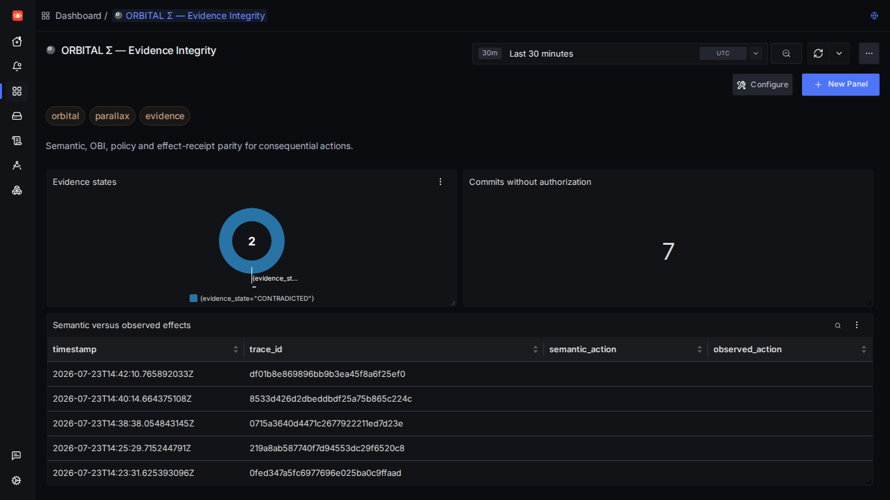](assets/signoz/03-trace-funnel.png) | Trace-matching relationship for missing authorization or effect verification | Captured live query/funnel state | Refresh only when the funnel query and time range include the intended hero run | Query sophistication slide |
| `docs/assets/signoz/04-alert-history.png` | [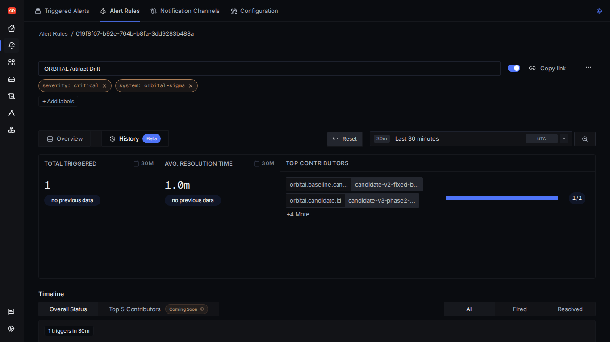](assets/signoz/04-alert-history.png) | A real alert-history transition supporting signed WATCHTOWER delivery and rollback | Captured live local alert history | Refresh after `make verify-alerts`; show history, not just a rule definition | Alert-to-control slide |

### SigNoz asset inventory

ORBITAL version-controls **six dashboard definitions**:

1. Flight Readiness
2. Evidence Integrity
3. Causal Lab
4. Authority Frontier
5. Certified Production
6. Persistent Campaigns

It also version-controls **twelve alert definitions**:

1. Uncertified Agent Execution
2. Artifact Drift
3. Missing Authorization
4. Evidence Mismatch
5. Unsafe External Effect
6. Certificate Expiration
7. Canary Regression
8. Replay Fidelity Degradation
9. Policy Bundle Mismatch
10. High Causal Fragility
11. OBI Sensor Loss
12. Telemetry Cardinality Explosion

The committed final workflow exercised eight critical alert histories. Do not change that statement to “all twelve alerts fired” unless a later validated run proves it.

Foundry reproduces SigNoz and its managed MCP server. ORBITAL's idempotent provisioning script creates the six dashboards, twelve alerts, and saved views from repository definitions.

## Captions

| Filename | Link | Purpose | Evidence mode | Refresh note |
|---|---|---|---|---|
| `docs/assets/demo-captions.vtt` | [WebVTT source](assets/demo-captions.vtt) | Starting captions for the planned three-minute recording | Editorial asset, not execution evidence | Retimestamp against the final exported narration; verify all evidence terms and do not retain IDs that differ from the recorded run |

## Evidence identifiers from the committed final rehearsal

These identifiers support audit and navigation in the committed validation environment. A new clean run is expected to create new identifiers.

| Evidence | Identifier |
|---|---|
| Final refund contradiction trace | `df01b8e869896bb9b3ea45f8a6f25ef0` |
| Native OBI acceptance trace | `0fed347a5fc6977696e025ba0c9ffaad` |
| Causal finding | `7e888236023d5866916f8a30074e522f` |
| Delegation trace | `0715a3640d4471c2677922211ed7d23e` |
| Persistent campaign | `campaign_21fd67d4c1b832597fdc` |
| RANGE campaign | `range_39a97c1385cf1d8d49de` |
| Certificate | `ORB-2026_88F6FC3BB1E8B92F` |
| Certificate verdict | `CONDITIONAL` |

Source: [Phase 8 final validation](phase8-final-validation-2026-07-23.md#final-live-evidence).

## Asset-to-claim matrix

| Public claim | Minimum visual evidence | Supporting report |
|---|---|---|
| Semantic declaration contradicts observed action | Evidence Parity + SigNoz evidence trace | [Native OBI validation](obi-native-ubuntu.md) |
| SigNoz alert leads to rollback | Alert History + Certificate | [Phase 2 validation](phase2-live-alerts-validation-2026-07-22.md) |
| Causal analysis is bounded and inspectable | Causal Graph | [Phase 4C validation](phase4c-causal-validation-2026-07-23.md) |
| Hero reproducer reduced 17→7 | Causal Graph | [Phase 4C validation](phase4c-causal-validation-2026-07-23.md) |
| Evidence supports authority level 3 | Authority Frontier + Safety Case | [Phase 5 validation](phase5-frontier-clearance-validation-2026-07-23.md) |
| Certificate is signed and restricted | Certificate | [Phase 5 validation](phase5-frontier-clearance-validation-2026-07-23.md) |
| Authority laundering is blocked | Certificate delegation card or linked trace | [Phase 6 validation](phase6-multi-agent-custody-validation-2026-07-23.md) |
| UI is live-data driven and reconnectable | Launch Console + Replay Theater | [Phase 7 validation](phase7-mission-control-validation-2026-07-23.md) |
| Release is reproducible | Flight Readiness + final validation report | [Phase 8 validation](phase8-final-validation-2026-07-23.md) |

## Publication checklist

- [ ] Every Markdown image target exists in the repository.
- [ ] Every capture is readable at presentation scale.
- [ ] Evidence mode labels remain visible.
- [ ] No image contains a private key, token, credential, public IP, personal customer data, Windows-local path, unrelated browser tab, or shell history.
- [ ] The release shown is `v1.0.1`.
- [ ] Counts remain 120 capsules, 880 mutations, 64 selected cases, 256 causal branches, 17→7, six authority levels, level 3, 95 tests, six dashboards, and twelve alert definitions.
- [ ] The certificate is described as `CONDITIONAL`.
- [ ] Native OBI is described as project-local Ubuntu evidence.
- [ ] Static images are called captured evidence.
- [ ] Repository and release links resolve.
